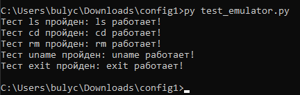
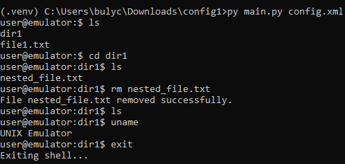

## Задание №1
Разработать эмулятор для языка оболочки ОС. Необходимо сделать работу
эмулятора как можно более похожей на сеанс shell в UNIX-подобной ОС.
Эмулятор должен запускаться из реальной командной строки, а файл с
виртуальной файловой системой не нужно распаковывать у пользователя.
Эмулятор принимает образ виртуальной файловой системы в виде файла формата
zip. Эмулятор должен работать в режиме CLI.
Конфигурационный файл имеет формат xml и содержит:
• Имя пользователя для показа в приглашении к вводу.
• Имя компьютера для показа в приглашении к вводу.
• Путь к архиву виртуальной файловой системы.
• Путь к лог-файлу.
Лог-файл имеет формат csv и содержит все действия во время последнего
сеанса работы с эмулятором. Для каждого действия указаны дата и время. Для
каждого действия указан пользователь.
Необходимо поддержать в эмуляторе команды ls, cd и exit, а также
следующие команды:
1. uname.
2. rm.
Все функции эмулятора должны быть покрыты тестами, а для каждой из
поддерживаемых команд необходимо написать 3 теста.
## Описание

Этот проект представляет собой эмулятор оболочки (CLI), который симулирует работу с виртуальной файловой системой, предоставляемой в виде ZIP-архива. Эмулятор предоставляет базовые команды оболочки UNIX-подобной ОС, такие как `ls`, `cd`, `exit`, а также дополнительные команды: `uname` и `rm`.

### Особенности:
- Поддержка команд:
  - `ls`: Показать содержимое текущей директории.
  - `cd`: Перемещение между каталогами.
  - `exit`: Завершение работы эмулятора.
  - `uname`: Показать информацию о системе (имя пользователя и имя компьютера).
  - `rm`: Удаление файла или каталога.
- Конфигурация и журналирование:
  - Конфигурационный файл XML с настройками.
  - Логирование действий с временными метками в CSV-файл.
- Эмулятор работает в режиме командной строки (CLI) и использует образ виртуальной файловой системы в формате ZIP.

## Требования

- Python 3.7+
- Библиотеки:
  - `zipfile` для работы с архивами
  - `os` для работы с файловой системой
  - `shutil` для удаления файлов
  - `xml.etree.ElementTree` для чтения конфигурации XML
  - `csv` для записи в лог-файл

## Установка

1. Клонируйте репозиторий:
   ```bash
   git clone https://example.com/config1.git
   cd config1
## Запуск
- перейти в нужную папку
 ```bash
.venv/Scripts/activate
py main.py example/config.xml
```
- Выведется user@hostname
## Работа


